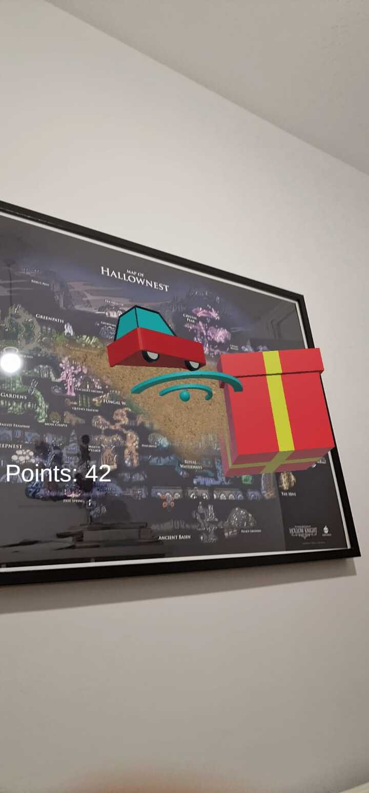

# Interfaces Inteligentes  
## Aplicaciones de Realidad Aumentada en Unity - ARFoundation

**Autores:**
- Alexander González Covic (alexander.covic.16@ull.edu.es)
- Miguel Luna García (miguel.luna.19@ull.edu.es)
- Adriano dos Santos Moreira (adriano.moreira.07@ull.edu.es)

#

- Ejercicio 1:  
Construimos la aplicación de ejemplo siguiendo el [tutorial](https://codelabs.developers.google.com/arcore-unity-ar-foundation)   

- Ejercicio 2:  
Mostramos por pantalla el número de paquetes recogidos  
  

- Ejercicio 3:  
Creamos una versión con seguimiento horizontal para colocar un objeto en la pared  
  
